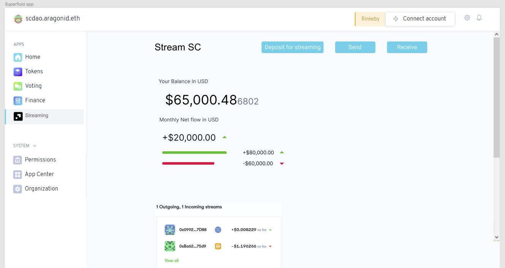
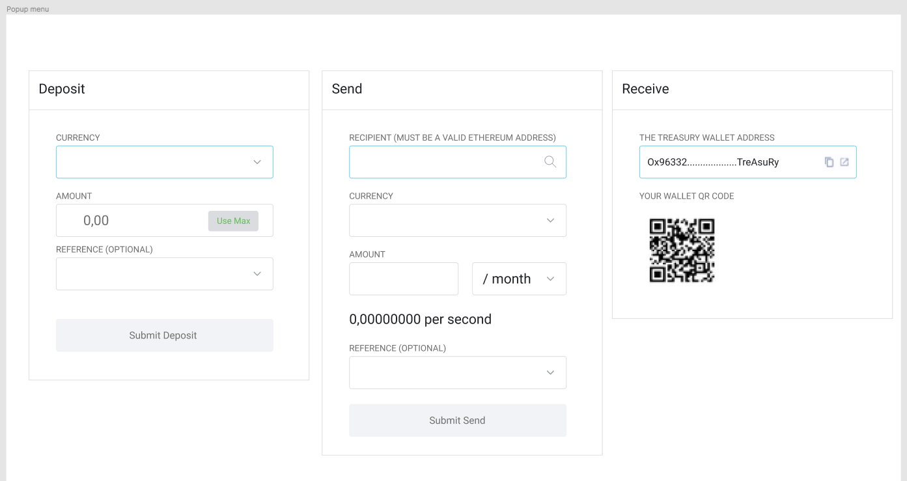

#### DAO Global Bounty Project


# Aragon Streaming App

As streaming money becomes the new normal DAOs will naturally lead the way. If the [Aragon](https://aragon.org/) client handles [Superfluid](https://superfluid.finance/) streaming payments then many DAOs can inherit the primitive.

We integrated Superfluid payment streams following the design philosophy of Aragon:
> "...architect apps to do one thing and one thing well and to respect and implement the few aragonOS interfaces"

Our team[^0] implemented an app, named *Streaming*, that includes functions to upgrade/downgrade tokens to Super Tokens and then manage payment streams. Once installed a DAO will be able to stream money, over time, to its members and other entities.

## No UI

In the last hours we ran into two showstopping problems:

1. Supertokenaddresses: due to the sandboxed nature of Aragon we found it impossible to interact with the SF framework directly. Our contract also didn’t provide a method to get a list of supertokenaddresses to the front-end. We got around this by adding a manual address so you always deposit the same token, DAIx, but that was a stopgap workaround.

2. However we get a message that we don’t have permission to perform the ‘deposit for streaming’ action. This is also a security measure by Aragon and we couldn't figure out how to set the permission correctly in the local blockchain (Buidler-hooks). It was also not possible to change in the permissions menu.

So there is no UI to see because you would not get beyond the error message about permissions. Probably these issues are solvable but we ran out of time.

## Demo Video
This [Aragon Streaming App demo](https://youtu.be/DraGMAAQu6g) is only an intro and explanation of our process.

## How to run locally

```sh
cd streaming
npm install
npm start
```

## Design Sketches

We first made a [design in Figma](https://www.figma.com/file/PBHpbJMYFHCrUeRCWrEHQo/Aragon-DAO-%2B-Super-app?node-id=8%3A2) to be visually consistent with the Aragon UI, the preliminary mock up helped us thinking through the user journey.

### Streaming App Overview


### Transact Slidebars


[^0]: Collaborated by @SmilingHeretic, @eurvin, @poissonpoivre, @kitblake with support from Superfluid astronauts.
